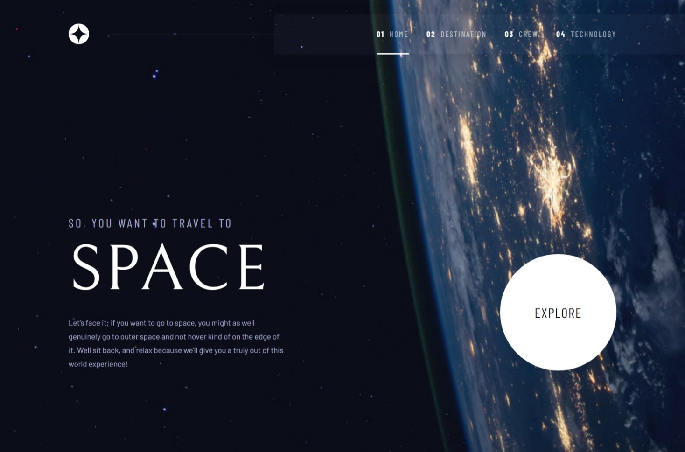
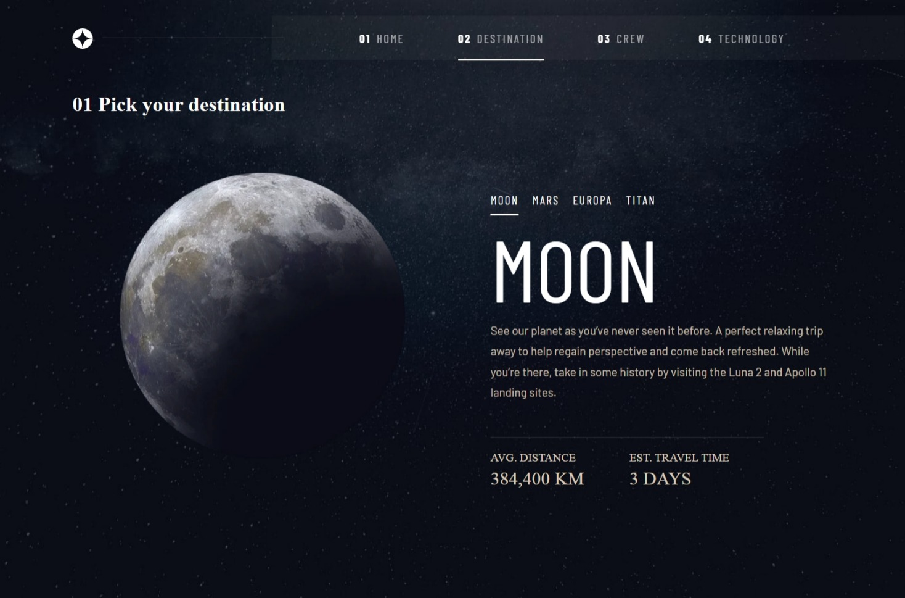
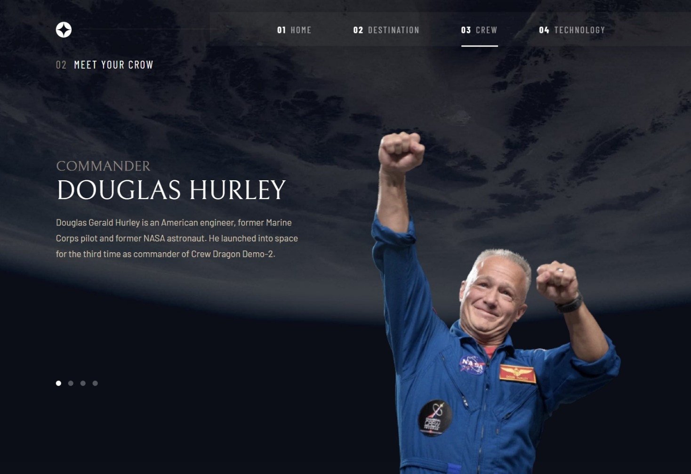

# Frontend Mentor - Space tourism website solution

This is a solution to the [Space tourism website challenge on Frontend Mentor](https://www.frontendmentor.io/challenges/space-tourism-multipage-website-gRWj1URZ3).

## Table of contents

-   [Overview](#overview)
    -   [The challenge](#the-challenge)
    -   [Screenshot](#screenshot)
    -   [Links](#links)
-   [My process](#my-process)
    -   [Built with](#built-with)
    -   [What I learned](#what-i-learned)
    -   [Continued development](#continued-development)
    -   [Useful resources](#useful-resources)
-   [Author](#author)
-   [Acknowledgments](#acknowledgments)

## Overview

### The challenge

Users should be able to:

-   View the optimal layout for each of the website's pages depending on their device's screen size
-   See hover states for all interactive elements on the page
-   View each page and be able to toggle between the tabs to see new information

### Screenshot







### Links

-   [Solution URL](https://www.frontendmentor.io/solutions/spacetourism-ybbYDB29tK)
-   [Live Site URL](https://ymhaah.github.io/space-tourism/)

## My process

### Built with

-   Semantic HTML5 markup
-   CSS custom properties
-   Flexbox
-   CSS Grid
-   Mobile-first workflow
-   A11y & aria Standards
-   Gsap

### What I learned

This project was created with the main goal is to focus on accessibility.
I have implemented many new principles in this project such as:

-   the Hidden Link that skip the navigation menu

```html
<a href="#home" title="click Enter to skip navigation menu"
	>skip to the content</a
>
```

-   using aria-controls & aria-expanded whit the navigation menu button

```html
<button
	type="button"
	aria-controls="main-navigation-list"
	aria-expanded="false"
	class="mobile-nav-toggle"
></button>
```

-   the visually-hidden class

```css
.visually-hidden {
	position: absolute;
	position: absolute !important;
	width: 1px !important;
	height: 1px !important;
	padding: 0 !important;
	margin: -1px !important;
	overflow: hidden !important;
	clip: rect(0, 0, 0, 0) !important;
	white-space: nowrap !important;
	border: 0 !important;
}
```

-   using Gsap to make easy animations

```js
gsap.to('ul[date-visible="true"]', {
	duration: 0.5,
	xPercent: -100,
});
```

### Continued development

-   using the Json file more
-   using React
-   A11y & aria Standards
-   Gsap & gsap ScrollTrigger

### Useful resources

Check out my latest previous articles:

-   [how to make an Indestructible button?](https://dev.to/ymhaah/how-to-make-an-indestructible-button-3f2h)
-   [Top 5 Icon websites for devs and designers!!!](https://dev.to/ymhaah/top-5-icon-websites-for-devs-and-designers-53mh)
-   [30-Day React Learning Journey!](https://dev.to/ymhaah/series/20473)

## Author

-   professional links:
    -   [Twitter](https://twitter.com/hafanwi)
    -   [LinkedIn](https://www.linkedin.com/in/youssef-hafnawy/)
    -   [GitHub](https://github.com/ymhaah)
-   Hire me:
    -   [UpWork](https://www.upwork.com/services/product/development-it-a-custom-and-responsive-websites-in-wordpress-1577236892828233728?ref=project_share)
    -   [Freelancer](https://freelancer.com/u/ymhaah)
-   Blog:
    -   [HashNode](https://hafnawi.hashnode.dev/)
    -   [Dev.to](https://dev.to/ymhaah)
    -   [Medium](https://medium.com/@ymhaah250)
